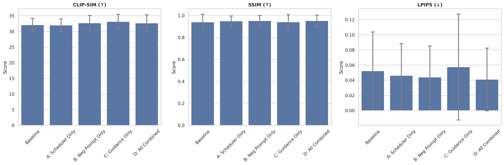

# 🎬 Mochi-Enhance: Training-Free Video Diffusion Optimization

[](https://opensource.org/licenses/MIT)
[](https://www.python.org/downloads/)
[](https://pytorch.org/)

**Mochi-Enhance** is a research-driven framework for significantly improving the temporal consistency and semantic alignment of the **Mochi-1-preview** open-weight video diffusion model.

Our methodology achieves superior results **without any fine-tuning or external post-processing networks**, leveraging native model manipulations during the diffusion process.

---

## Key Improvements

By independently manipulating the **Flow Match Euler Discrete Scheduler**, injecting **structured negative embeddings**, and amplifying **classifier-free guidance**, we achieve:

* **+1.3% Absolute SSIM Improvement**: Smoother, more stable temporal consistency.
* **-21% LPIPS Reduction**: Drastic reduction in visual artifacts and "morphing" effects.
* **Zero Computational Overhead**: Enhancements run natively during diffusion with no extra latency.
* **Improved Prompt Adherence**: Higher CLIP-SIM scores for complex prompts.

### Qualitative Comparison


*Figure 1: Side-by-side comparison of baseline (top) vs. our enhanced methodology (bottom) across various prompts.*

---

## Features

## Features

* **Parallelized Ablation Suite**: Automatically runs 75+ experiments across multiple GPUs using PyTorch multiprocessing.
* **Comprehensive Evaluation**: Built-in lazy-loading metrics suite for CLIP-SIM, SSIM, LPIPS, and Fréchet Video Distance (FVD).
* **Interactive Demo**: A dedicated Gradio GUI for real-time comparison and metric visualization.
* **Visualization Engine**: Automated generation of publication-ready LaTeX tables, bar charts, and variance plots.

---

## Computational Requirements

Mochi-1-preview is a large-scale video diffusion model (~10B parameters). To ensure the pipeline runs smoothly without CUDA out-of-memory errors, please note the following requirements:

> [!IMPORTANT]
> **GPU Memory (VRAM):**
>
> * **Optimal:** 48GB+ (e.g., NVIDIA A6000, A100) for full-speed inference and parallel ablation studies.
> * **Minimum:** 24GB (e.g., RTX 3090, 4090). The code is optimized with `enable_model_cpu_offload()` and `enable_vae_tiling()` to support high-end consumer hardware.

* **System RAM:** 64GB or more is highly recommended to handle model weights and CPU offloading.
* **Disk Space:** Approximately 30GB for model weights (downloaded automatically via Hugging Face) and generated artifacts.
* **Software:** Linux or Windows with WSL2 is recommended for optimal PyTorch performance.

---

## Installation

```bash
# Clone the repository
git clone https://github.com/Ramez-Asaad/selected-topics-in-AI-project.git
cd selected-topics-in-AI-project

# Install all dependencies (Unified)
pip install -r requirements.txt
```

---

## Usage

### 1. Launch the Interactive GUI

Experience the enhancements in real-time with our Gradio-based comparison tool:

```bash
python app_gui.py
```

### 2. Run the Full Ablation Study

To reproduce our research results across multiple GPUs:

```bash
python main.py
```

### 3. Generate Research Artifacts

After running experiments, generate the figures and tables used in the paper:

```bash
python visualize.py
python extract_frames.py
```

---

## Experimental Results

## Experimental Results


*Figure 2: Statistical improvement in temporal stability (SSIM/LPIPS) across all experimental configurations.*

For a deep dive into our methodology and numerical analysis, please refer to our full manuscript:
📄 **[Read the Paper (PDF)](paper/paper.pdf)**

---

## Repository Structure

## Repository Structure

* `app_gui.py`: Interactive Gradio interface for real-time testing.
* `main.py`: Orchestration script for parallelized research experiments.
* `eval.py`: Core evaluation suite (CLIP, SSIM, LPIPS, FVD).
* `paper/`: Contains the IEEE-format LaTeX manuscript and compiled PDF.
* `results/`: Experimental outputs, logs, and generated figures.
* `config.py`: Centralized hyperparameters and ablation settings.

---

## License

This project is released under the **MIT License**.
*Note: Mochi-1-preview model weights are governed by the respective Genmo Hugging Face licenses.*

---
*Created by [Ramez Asaad](https://github.com/Ramez-Asaad) as part of the AIE418 Selected Topics in AI course.*
